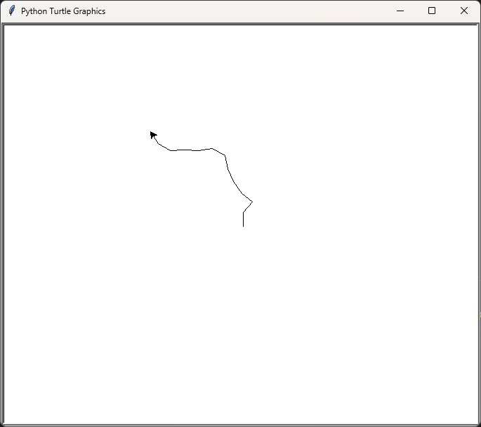
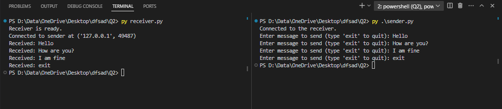

# Drona-Python-Assignment
## Task 1: Simulated Drone Movement System

### Problem Statement
The repository contains Python code for simulating drone movement within a defined environment. Users can control the drone's movement and visualize its trajectory.

### Output


---

## Task 2: TCP Socket Communication

### Problem Statement
This section demonstrates TCP socket communication between a client and a server using Python scripts.

### Instructions
1. Run `receiver.py` first:
    ```
    python receiver.py
    ```
2. Then run `sender.py`:
    ```
    python sender.py
    ```

### Output

---
